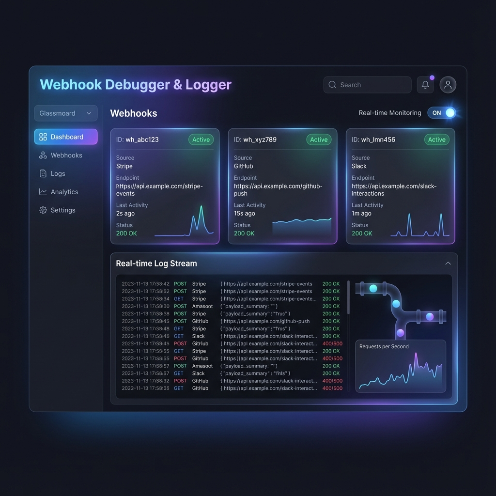
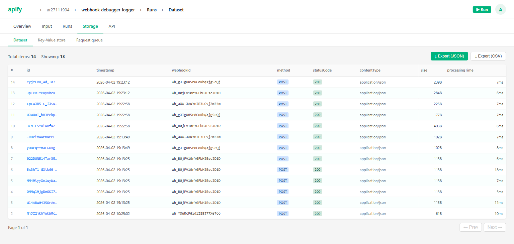
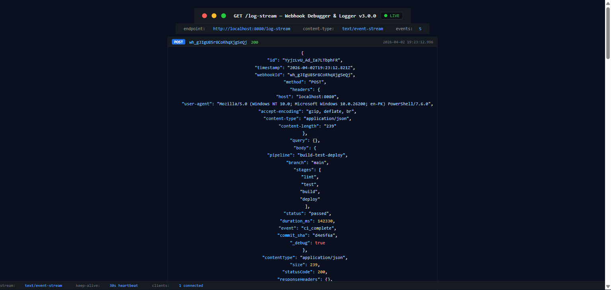

# 🚀 Webhook Debugger & Logger v2.7.0 (Enterprise Suite)



A high-performance Apify Actor built for developers to test, inspect, and automate incoming webhooks in real-time. This Actor is optimized for **Apify Standby Mode**, providing sub-10ms logic execution and zero cold-start latency.

## ⚡ Quick Start: Live Demo (Local)

Run the following command while the Actor is active to see real-time streaming:

```bash
# If authKey is configured, run with:
# AUTH_KEY=your-secret node demo_cli.js
node demo_cli.js
```

Test and inspect webhooks instantly without running localhost or complex tunneling tools.

**[Watch the 2-min Narrated Walkthrough](https://youtu.be/uefialldYYw)**

## What does it do?

Webhook Debugger generates temporary webhook URLs and logs every incoming request with full details (headers, body, query params). Perfect for testing webhook integrations from Stripe, GitHub, Shopify, or any service.

## 💡 Popular Use Cases

- **Stripe & PayPal Debugging**: Mock successful or failed payment responses to test your order fulfillment logic.
- **GitHub CD/CI Testing**: Verify complex payloads from CI/CD triggers without waiting for real builds.
- **Shopify Webhook Relay**: Securely forward Shopify hooks to your local development environment.
- **n8n & Zapier Buffer**: Acts as a high-performance validator for your automation workflows.
- **API Mocking**: Simulate slow or faulty 3rd party APIs with custom responses and latency.

## 📖 Workflow Playbooks & "Launch Packs"

Stop building generic tools and start solving real problems. Use these pre-configured setup guides for your specific tech stack:

- **[💳 Stripe Hardening Pack](file:///home/ar27111994/Projects/Apify/Webhook%20Debugger%20&%20Logger/docs/playbooks/stripe.md)**: Verify signatures, inspect payloads, and replay payment events safely.
- **[🛍️ Shopify Launch Pack](file:///home/ar27111994/Projects/Apify/Webhook%20Debugger%20&%20Logger/docs/playbooks/shopify.md)**: Bridge Shopify webhooks to your local machine with 72h retention for high-traffic windows.
- **[💬 Slack & Messaging](file:///home/ar27111994/Projects/Apify/Webhook%20Debugger%20&%20Logger/docs/playbooks/slack.md)**: Test complex message blocks and interactive components.

---

## Why use Webhook Debugger?

### The Problem

Debugging webhooks is painful:

- ❌ Can't see what data services send
- ❌ No way to inspect payloads
- ❌ Localhost tunneling is complicated (ngrok, etc.)
- ❌ Failed webhook tests require service reconfiguration

### The Solution

1. **Run Webhook Debugger**
2. **Get 3 unique webhook URLs**
3. **Configure service to send to those URLs**
4. **See all requests in real-time**
5. **Export logs as JSON/CSV**

No setup required. No localhost tunneling. Takes 30 seconds.

## What can this Actor do?

| Feature             | Description                                             |
| ------------------- | ------------------------------------------------------- |
| **URL Generation**  | Generate 1-10 temporary webhook URLs                    |
| **Request Logging** | Capture ALL incoming requests (GET, POST, etc.)         |
| **Full Details**    | Headers, body, query params, IP, timing                 |
| **Multi-Format**    | Handles JSON, Text, XML, and Form Data                  |
| **Auto-Cleanup**    | URLs and data expire automatically (configurable 1-72h) |
| **Export**          | Download logs as JSON or CSV from dataset               |

## 🚀 v2.0 Enterprise Features

The Enterprise Update transforms this Actor into a professional API mocking and workflow tool.

### 🛡️ Security & Access Control

- **API Key Auth**: Require a secret token for every incoming webhook.
- **IP Whitelisting**: Lock down your endpoints to specific IPs or CIDR ranges.
- **Rate Limiting (v2.6)**: Protect your management endpoints (`/logs`, `/info`, `/replay`) with configurable per-IP rate limits.
- **Sensitive Data Masking (v2.6)**: Automatically redact known sensitive headers like `Authorization` and `Cookie` from your logs.

### 🎭 API Mocking & Latency

- **Custom Responses**: Define the exact Body, Headers, and Status Code to return to the sender.
- **Latency Simulation**: Simulate slow network conditions by delaying responses (up to 10s).
- **JSON Schema Validation**: Reject invalid payloads automatically and log the errors.

- [x] Pre-Launch Quality Score Optimization (Target: 75+)
  - [x] Restore lost schema metadata (examples, descriptions, views)
  - [x] Audit: Input & Output Schema
  - [x] Audit: README Completeness
  - [x] Audit: Documentation Quality
  - [x] Audit: Error Handling & Reliability
- [x] Implement Community Feedback (Reddit)
  - [x] Create Workflow Playbooks (Stripe, Shopify)
  - [x] Implement "One-Click" config links
  - [x] Draft Growth & Monitoring Guide

### 🔄 Advanced Workflows

- **Real-time Forwarding**: Automatically pipe captured webhooks to another destination (e.g., your local dev server).
- **Request Replay**: Resend any captured event to a new URL using the `/replay` API.

### ⚡ Technical Excellence & Platform Quality (v2.5)

- **Standby Mode Ready**: Built for sub-10ms response times with full support for Apify's warm-start infrastructure.
- **Scalable Real-time Feed**: v2.6 features a high-performance global SSE heartbeat mechanism, supporting hundreds of concurrent watchers with minimal memory footprint.
- **Readiness Probes**: Explicit handling of platform health checks for maximum uptime.
- **Graceful Termination**: Advanced shutdown sequence that ensures state persistence even during platform migrations.
- **QA Certified**: Specialized startup logic ensures consistent success in automated platform tests.

---

### Simple mode (basic)

```json
{
  "urlCount": 3,
  "retentionHours": 24
}
```

### Advanced mode

```json
{
  "urlCount": 5,
  "retentionHours": 72,
  "maxPayloadSize": 10485760,
  "enableJSONParsing": true
}
```

### Enterprise/CI integration

```json
{
  "urlCount": 1,
  "authKey": "my-secure-ci-token",
  "allowedIps": ["34.250.0.0/16"],
  "jsonSchema": "{\"type\":\"object\",\"required\":[\"commit_id\"]}",
  "forwardUrl": "https://ci-collector.internal.com/hooks",
  "maskSensitiveData": true
}
```

### ⚙️ Input Schema Preview


## Output example

### JSON format (Dataset)

```json
{
  "timestamp": "2025-12-19T14:31:45Z",
  "webhookId": "wh_abc123",
  "method": "POST",
  "headers": {
    "content-type": "application/json",
    "user-agent": "Stripe/1.0"
  },
  "body": "{\"type\": \"payment.success\", \"amount\": 9999}",
  "size": 78,
  "contentType": "application/json",
  "processingTime": 12,
  "remoteIp": "1.2.3.4"
}
```

### Advanced Event Metadata (v2.7+)

```json
{
  "id": "evt_8m2L5p9xR",
  "timestamp": "2025-12-28T12:00:00Z",
  "webhookId": "wh_ci_prod_1",
  "method": "POST",
  "statusCode": 201,
  "processingTime": 450,
  "remoteIp": "34.250.12.34",
  "forwardStatus": "SUCCESS",
  "originalEventId": null
}
```

### CSV Output Format (Preview)

| Timestamp        | Webhook ID | Method | Status | Content-Type                      | Size (B) | Latency (ms) |
| :--------------- | :--------- | :----- | :----- | :-------------------------------- | :------- | :----------- |
| 2025-12-19 14:31 | wh_abc123  | POST   | 200    | application/json                  | 1,240    | 12           |
| 2025-12-19 14:35 | wh_xyz789  | GET    | 401    | -                                 | 0        | 5            |
| 2025-12-19 14:40 | wh_abc123  | POST   | 200    | application/x-www-form-urlencoded | 450      | 8            |

### 📊 Dataset View



## How to get started

**Step 1**: Start the Actor and wait for it to enter "Running" state.

**Step 2**: Click on the **Live View** or check the **Key-Value Store** for the `WEBHOOK_STATE` key to see your assigned IDs.

**Step 3**: Use the URL format: `https://<actor-run-id>.runs.apify.net/webhook/<id>`

**Step 4**: Configure your service (Stripe, GitHub, etc.) to send to this URL.

**Step 5**: When webhooks arrive, they'll appear in the **Dataset** tab in real-time.

## Usage Examples

### 1. Simple GET request

```bash
curl -v https://<ACTOR-RUN-URL>/webhook/wh_abc123?test=true
```

### 2. Post JSON data

```bash
curl -X POST -H "Content-Type: application/json" \
  -d '{"event": "user_signup", "userId": "123"}' \
  https://<ACTOR-RUN-URL>/webhook/wh_abc123
```

### 3. Send raw text/XML

```bash
curl -X POST -H "Content-Type: text/xml" \
  -d '<event><type>ping</type></event>' \
  https://<ACTOR-RUN-URL>/webhook/wh_abc123
```

### 4. Upload a small file

```bash
curl --upload-file document.txt https://<ACTOR-RUN-URL>/webhook/wh_abc123
```

### 5. Check active webhooks (Management API)

```bash
# Via Header
curl -H "Authorization: Bearer YOUR_KEY" https://<ACTOR-RUN-URL>/info

# Via Query Parameter
curl https://<ACTOR-RUN-URL>/info?key=YOUR_KEY
```

> [!NOTE]
> If you have not configured an `authKey` in the input, you can omit the authentication headers/parameters.

## Advanced Features

### Real-time Log Stream (SSE)

You can stream webhook logs in real-time as they arrive using Server-Sent Events (SSE). This is perfect for terminal monitoring or custom dashboards.

**Endpoint**: `https://<ACTOR-RUN-URL>/log-stream`

**How to monitor via CLI**:

```bash
curl -N https://<ACTOR-RUN-URL>/log-stream
```



### Forced Status Codes

You can force a specific HTTP status response by adding the `__status` query parameter to your webhook URL.

- `https://<URL>/webhook/wh_123?__status=401` -> Returns 401 Unauthorized
- `https://<URL>/webhook/wh_123?__status=500` -> Returns 500 Internal Server Error

### Filtering & Querying Logs (API)

You can retrieve and filter logs programmatically via the `/logs` endpoint.

**Endpoint**: `https://<ACTOR-RUN-URL>/logs`

**Query Parameters**:

- `webhookId`: Filter by a specific ID (e.g., `wh_abc123`)
- `method`: Filter by HTTP method (e.g., `POST`)
- `statusCode`: Filter by response code (e.g., `201`)
- `contentType`: Search for specific content types (e.g., `json`)
- `limit`: Number of items to return (default: 100)

**Example**:

```bash
curl "https://<ACTOR-RUN-URL>/logs?method=POST&statusCode=200"
```

### Filtering Logs (Platform)

Apify Datasets support basic filtering via API parameters.

- **Newest first**: Add `?desc=1`
- **JSON Clean**: Add `?clean=1` (omits Apify metadata)
- **Specific fields**: Add `?fields=timestamp,method,body`

## Integrations (Zapier / Make)

Webhook Debugger is the perfect "safe buffer" for your automations.

### Why integrate?

- **Logs everything**: Even if your Zap fails, you have the raw request in Apify.
- **Payload transformation**: Apify datasets make it easy to clean/inspect data before it hits your automation.

### Setup Guide (Zapier/Make/n8n)

You can integrate your debugger with external tools in two distinct ways:

#### Option A: Real-time Forwarding (Recommended 🚀)

Use this if you want your automation to trigger **immediately** (sub-100ms) when a webhook is received.

1. **In Zapier**: Create a Zap and use the **"Webhooks by Zapier"** app with the **"Catch Webhook"** trigger. Copy the generated URL.
2. **In Apify**: Paste that URL into the **"Automated Pipe URL"** field in your Actor's input.
3. **Control**: Use the **"Pass Original Headers"** toggle to decide if your automation needs the original source headers or just the raw payload.

#### Option B: Platform Integrations (Monitoring 📊)

Use this to trigger actions based on lifecycle events or safely after data is stored.

1. **In Apify**: Go to the **Integrations** tab of your Actor.
2. **Setup**: Add a "Webhooks" integration triggered on **"Dataset item created"**.
3. **Flow**: `Source` -> `Debugger` -> `Apify Storage` -> `Zapier`.
4. **Benefit**: Guaranteed delivery even if your external tool is temporarily down (via Apify's retry logic).

## 💰 Pricing & Economics

This Actor uses a transparent **Pay-per-Event (PPE)** pricing model. This means you only pay for the resources you actually consume during active debugging, with no monthly subscription overhead.

- **Rate**: $0.01 per 1 captured webhook.
- **Batching**: 100 webhooks = $1.00.
- **Batching**: 1,000 webhooks = $10.00.

**Why PPE?**
Standard tools like ngrok or dedicated SaaS webhooks charge fixed monthly fees. With Webhook Debugger, you can keep an endpoint active for a month and only pay if you actually trigger a test.

## 📈 Performance & Limits

| Parameter         | Default   | Buffer             | Note                      |
| ----------------- | --------- | ------------------ | ------------------------- |
| **Max Payload**   | 10MB      | Up to 100MB        | Configurable in input     |
| **Concurrency**   | Unlimited | Platform-dependent | Limited by memory         |
| **Latency**       | <10ms     | Sub-5ms in Standby | Internal processing time  |
| **SSE Heartbeat** | 30s       | -                  | Global efficient interval |
| **History (TTL)** | 24h       | 1-72h              | Auto-cleanup active       |

## FAQ

**Q: How long are webhook URLs valid?**
A: By default, 24 hours. You can set 1-72 hours in the input.

**Q: Will you store my data?**
A: No. Data is stored only in your Apify dataset (you own this). After the retention period expires, URLs and old requests are cleaned up.

**Q: What's the payload size limit?**
A: 10MB by default to ensure stability. Configurable in input up to 100MB.

**Q: Can I use this with Zapier or Make?**
A: Yes! It's an ideal "safe buffer." You can point your service to this Actor, then use an Apify Webhook to trigger your Zapier/Make flow whenever a new item is added to the dataset.

**Q: Can I customize the response headers and body?**
A: Yes! Enterprise features (v2.0+) allow you to define custom JSON/XML response bodies, arbitrary headers, and even simulate network latency (delay).

**Q: Can I validate incoming data?**
A: Yes. You can provide a JSON Schema in the input parameters, and the Actor will automatically reject invalid requests with a 400 Bad Request.

**Q: Can I transform the data before it's saved?**
A: Yes. Use the **Custom Scripting** (v2.1+) feature to provide a JavaScript snippet that modifies the event object in real-time.

## Troubleshooting

**Issue**: "Webhook not found or expired"
**Solution**: Verify the webhook ID is correct. Check the `/info` endpoint of your running Actor to see active IDs. If it expired, restart the Actor to generate new ones.

**Issue**: "Script Execution Error"
**Solution**: Check your `customScript` for syntax errors. The Actor runs scripts in a secure sandbox with a 1s timeout.

**Issue**: "JSON Schema Validation Failed"
**Solution**: The incoming payload did not match your provided schema. Check the `/logs` or the webhook response for specific validation error details.

**Q: Can I transform data before it's saved?**
A: Yes. Use the **Custom Scripting** feature to write JavaScript that modifies the `event` object dynamically.

**Q: How do I handle heavy traffic?**
A: The Actor is built on a high-performance Express server. For heavy traffic, ensure you have enough memory (1024MB+ recommended) and consider using **HTTP Forwarding** to offload processing to your own infrastructure.

**Q: Is there a limit on the number of webhooks?**
A: You can generate up to 10 unique endpoints per Actor run. If you need more, you can start multiple runs or use different IDs with the same endpoint by routing logic in your `customScript`.

---

## 🆘 Support & Community

We are committed to providing first-class support for our "Enterprise Suite" users.

- 💬 **Apify Discord**: Join the [Apify Discord Community](https://discord.gg/jyEM2PRvMU) to chat with other developers.
- 📚 **Learning**: Explore the [Apify Academy](https://docs.apify.com/academy) for best practices on building resilient Actors.
- 📖 **Documentation**: Read the [Apify SDK Documentation](https://sdk.apify.com/) for technical deep dives.
- 🔗 **Console**: Manage your active runs in the [Apify Console](https://console.apify.com).
- 🛠️ **Alternative**: Compare with [Webhook.site](https://webhook.site) if you need a desktop-only alternative.
- 📝 **Issues**: Found a bug? Open an issue on our [GitHub Repository](https://github.com/ar27111994/webhook-debugger-logger).

**Developer Support Guarantee**: I am an active maintainer and respond to all comments, bug reports, and feature requests on the [Apify Store Console](https://apify.com/ar27111994/webhook-debugger-logger/comments) within **24 hours**.

## 🛡️ Security & Permissions

- **Permissions**: This Actor runs with **Limited Permissions** (the safest level).
- **Scope**: It only accesses its own default dataset (to log webhooks) and key-value store (to manage state).
- **Privacy**: It cannot access your other Actors, tasks, or datasets. Your data remains completely isolated.

## Privacy

We do **not** store any personal data beyond the raw request payloads you send. All data is kept only for the retention period you configure (default 24 h) and is automatically deleted afterwards. No data is shared with third parties.

For more details, see the [Apify Privacy Policy](https://apify.com/privacy).
