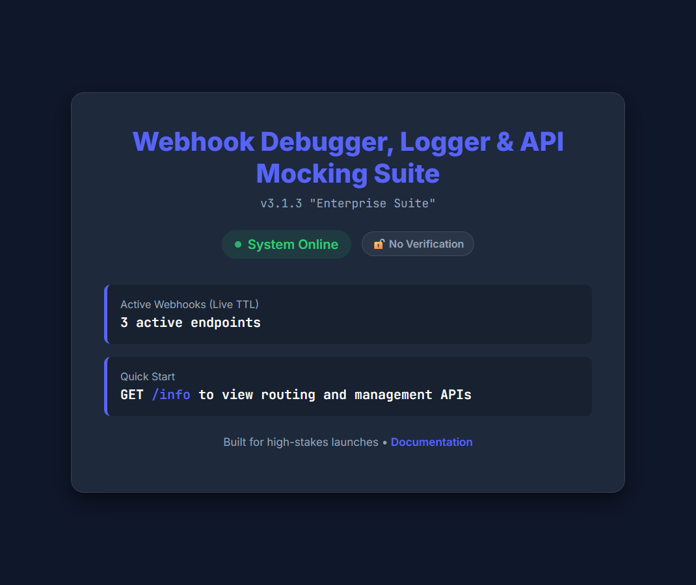
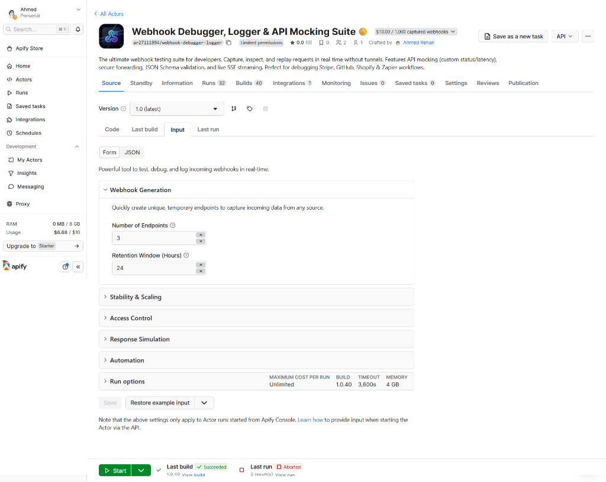
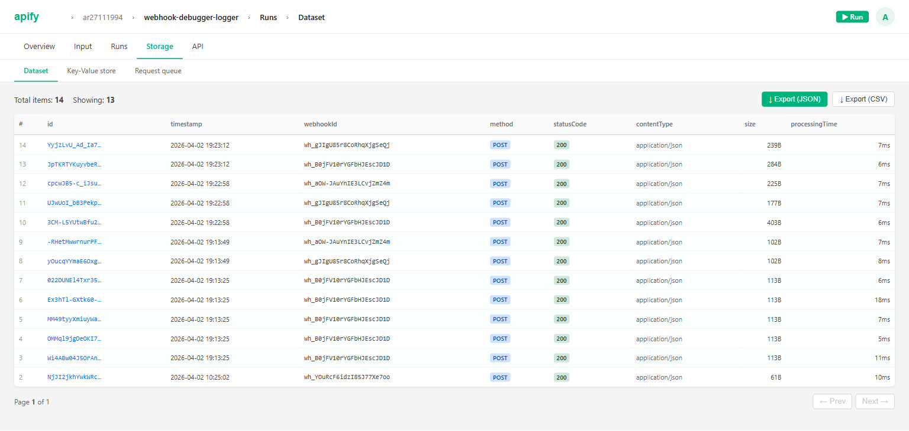
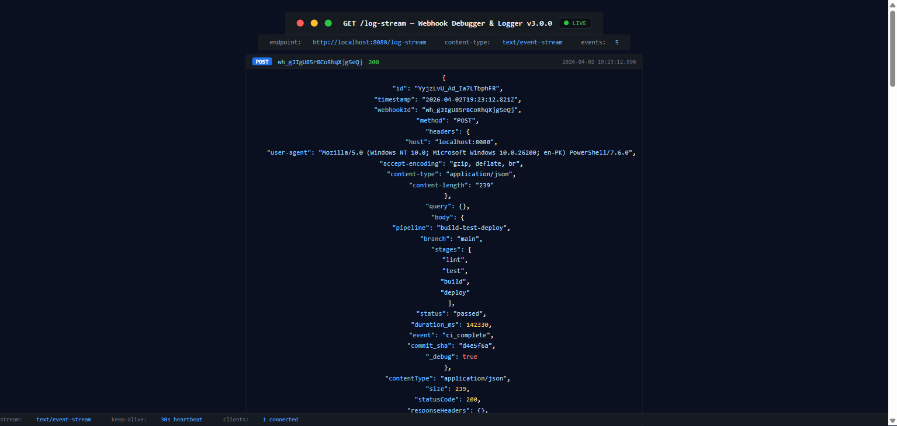
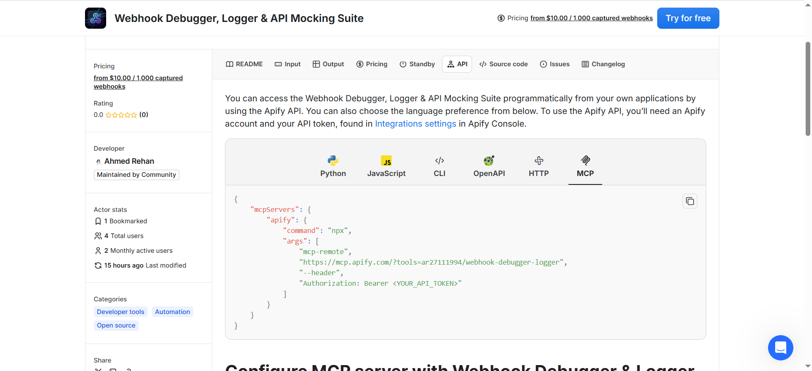
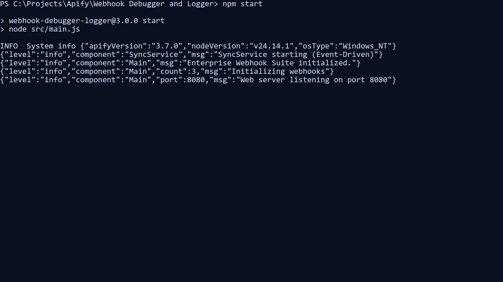
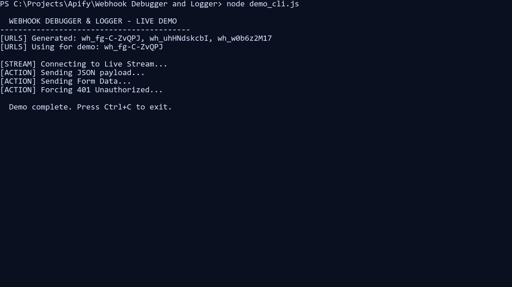
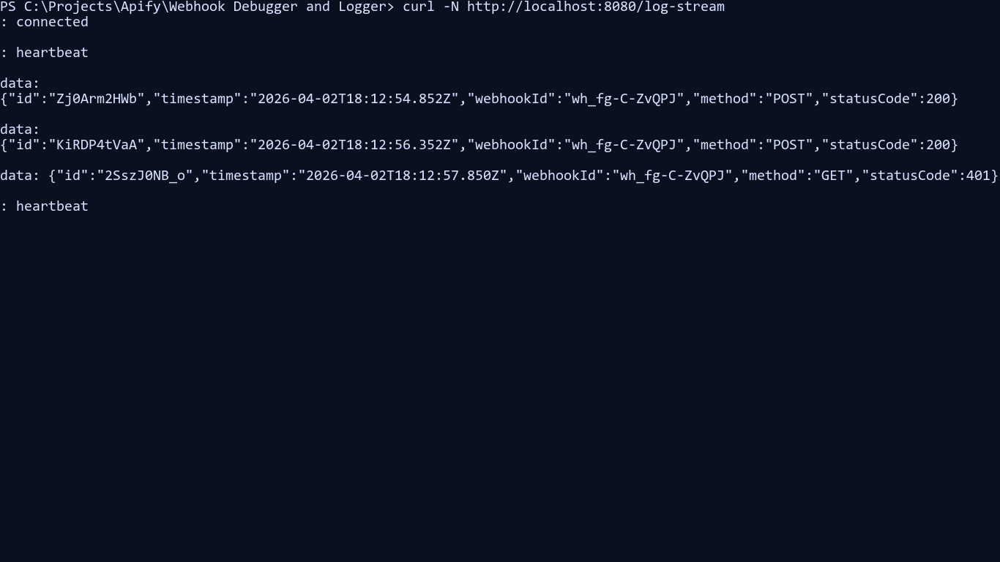

# Webhook Debugger, Logger & API Mocking Suite


Generate temporary webhook URLs, inspect every incoming request, replay failures, and simulate callback behavior without tunneling localhost.

## Status

[](https://github.com/ar27111994/webhook-debugger-logger/actions/workflows/ci.yml)
[](https://github.com/ar27111994/webhook-debugger-logger/releases)
[](https://www.npmjs.com/package/webhook-debugger-logger)
[](https://www.npmjs.com/package/webhook-debugger-logger)
[](https://nodejs.org/)
[](https://opensource.org/licenses/ISC)
[](https://github.com/ar27111994/webhook-debugger-logger/pkgs/container/webhook-debugger-logger)

[](https://www.producthunt.com/products/webhook-debugger-logger-api-mocker?embed=true&utm_source=badge-featured&utm_medium=badge&utm_campaign=badge-webhook-debugger-logger-api-mocker)

## Run & Docs

[](https://apify.com/ar27111994/webhook-debugger-logger)
[](https://console.apify.com/actors/ar27111994~webhook-debugger-logger/input)
[](docs/api-reference.md)
[](docs/local_docker_testing.md)

## Contribute

[](https://github.com/ar27111994/webhook-debugger-logger/issues/new?template=bug_report.md)
[](https://github.com/ar27111994/webhook-debugger-logger/issues/new?template=feature_request.md)
[](CHANGELOG.md)
[](SECURITY.md)
[](CONTRIBUTING.md)

Webhook Debugger, Logger & API Mocking Suite is an [Apify Actor](https://apify.com/ar27111994/webhook-debugger-logger) for testing webhook integrations end to end. It generates temporary endpoints, captures the full request envelope, exposes live and queryable logs, and lets you replay or forward captured traffic to another destination.

It is designed for developers working with providers such as Stripe, GitHub, Shopify, Slack, and custom internal webhooks who need more than a generic request bin.

> [!NOTE]
> This actor is optimized for testing, debugging, replay, and callback simulation. If you need permanent public ingress or long-term retention, place it behind your own infrastructure or run the self-hosted container with persistent storage.
> [!WARNING]
> Generated webhook URLs are public unless you enable `authKey`, `allowedIps`, or signature verification. Do not point sensitive production traffic to unsecured endpoints.

## Screenshots

> [!NOTE]
> The Apify Store input tab always reflects the most recently published build. To avoid showing stale configuration fields, this README documents input options from the current repo schema in [.actor/input_schema.json](.actor/input_schema.json) and uses a live local runtime screenshot below.

### Built-in dashboard



## Key input options

The current repo schema is defined in [.actor/input_schema.json](.actor/input_schema.json). These are the settings most users touch first.

| Input                   | Purpose                                                                                                           | Default    |
| ----------------------- | ----------------------------------------------------------------------------------------------------------------- | ---------- |
| `urlCount`              | Number of temporary webhook endpoints to generate                                                                 | `3`        |
| `retentionHours`        | How long generated webhook URLs remain active                                                                     | `24`       |
| `maxPayloadSize`        | Maximum accepted request body size in bytes; values above 100 MB are clamped                                      | `10485760` |
| `enableJSONParsing`     | Parse JSON payloads into structured objects for search                                                            | `true`     |
| `maskSensitiveData`     | Redact sensitive headers such as `Authorization`, `Cookie`, `Set-Cookie`, and API key headers from logs           | `true`     |
| `authKey`               | Protect management routes and optionally webhook ingest with a shared key                                         | unset      |
| `allowedIps`            | Restrict traffic to specific IPs or CIDR blocks                                                                   | empty      |
| `signatureVerification` | Verify Stripe, Shopify, GitHub, Slack, or custom signatures                                                       | unset      |
| `forwardUrl`            | Forward every captured request to another destination                                                             | unset      |
| `defaultResponseCode`   | Return a custom HTTP status to the sender                                                                         | `200`      |
| `responseDelayMs`       | Simulate network latency or slow callback processing; accepted range is 0-10,000 ms and higher values are clamped | `0`        |
| `jsonSchema`            | Reject payloads that do not match a JSON Schema                                                                   | unset      |
| `customScript`          | Transform or enrich the captured event before storage                                                             | unset      |



## What does this actor do?

This project gives you a disposable webhook test environment with a documented HTTP API.

It helps you:

- generate 1 to 50 unique webhook URLs for a run
- inspect headers, query params, payloads, response status, timing, IP, and signature state
- stream events live over Server-Sent Events (SSE)
- replay captured requests to a new destination
- forward incoming traffic to another endpoint with retries and circuit breaking
- simulate downstream behavior with custom status codes, response bodies, headers, and latency
- trigger Slack or Discord alerts when a webhook run needs attention
- handle large request bodies by enforcing size limits and offloading oversized accepted payloads to storage
- validate JSON payloads and run custom JavaScript transformation scripts before storage
- plug the actor into Apify-native workflows, API automation, and MCP-enabled tooling that orchestrates Apify runs and datasets

## Why use it?

Webhook debugging is usually split across too many tools.

- You need one tool to expose a public URL.
- Another tool stores payloads.
- Another tool replays failures.
- Another tool simulates custom responses.

This actor combines those workflows in one place.

### Problems it solves

- No more tunneling localhost just to inspect a payload.
- No more guessing what a provider actually posted.
- No more manually rebuilding failed callbacks for retries.
- No more separate mock server just to test response codes or latency.

### Why teams pick it over a generic request bin

- It captures requests and exposes a searchable API, not just raw dumps.
- It supports replay and forwarding, not only passive logging.
- It can validate signatures for common webhook providers.
- It can alert Slack or Discord when capture, validation, or downstream delivery fails.
- It supports inline custom scripting for payload cleanup and transformation.
- It includes health, readiness, and metrics endpoints for operational setups.
- It can run on Apify or as a self-hosted Node/Docker service.

## What can this actor do?

| Feature                | What you get                                                                                             |
| ---------------------- | -------------------------------------------------------------------------------------------------------- |
| Temporary webhook URLs | Generate 1-50 unique endpoints per run with configurable retention                                       |
| Full request capture   | Method, headers, query, body, response body, response headers, size, latency, IP                         |
| Searchable logs        | DuckDB-backed `/logs` queries with pagination and detailed retrieval                                     |
| Live streaming         | Real-time event feed over `/log-stream` using SSE                                                        |
| Replay workflows       | Replay a captured request to a different target URL                                                      |
| HTTP forwarding        | Forward every incoming request to a destination with retries and circuit breaker protection              |
| API mocking            | Return custom status codes, headers, bodies, and artificial latency                                      |
| Alert notifications    | Send Slack or Discord notifications for `error`, `4xx`, `5xx`, `timeout`, or `signature_invalid` events  |
| Security controls      | Global API key, IP allowlist, sensitive header masking, provider signature verification                  |
| Large payload handling | Enforce request size limits and offload large accepted payloads so inspection stays practical            |
| Payload validation     | Optional JSON Schema validation and custom JavaScript transforms                                         |
| Platform integrations  | Apify web server, Dataset, Key-Value Store, saved runs, API automation, and MCP-friendly Apify workflows |
| Ops endpoints          | `/health`, `/ready`, `/system/metrics`, and `/info`                                                      |

## Quick start on Apify

### 1. Start the actor with a minimal config

```json
{
  "urlCount": 3,
  "retentionHours": 24,
  "enableJSONParsing": true,
  "maskSensitiveData": true
}
```

### 2. Open the generated runtime info

After the actor starts, open the web server URL and call `/info`.

```json
{
  "version": "3.0.0",
  "status": "Enterprise Suite Online",
  "system": {
    "authActive": false,
    "retentionHours": 24,
    "maxPayloadLimit": "10.0MB",
    "webhookCount": 3,
    "activeWebhooks": [
      {
        "id": "wh_demo123",
        "expiresAt": "2026-04-03T10:20:14.527Z"
      }
    ]
  },
  "features": [
    "High-Performance Logging & Payload Forensics",
    "Real-time SSE Log Streaming",
    "Smart Forwarding & Replay Workflows",
    "Isomorphic Custom Scripting & Latency Simulation",
    "Provider Signature Verification & Enterprise Security",
    "Large Payload Handling & Operational Health"
  ],
  "endpoints": {
    "logs": "https://<run-id>.runs.apify.net/logs?limit=100",
    "logDetail": "https://<run-id>.runs.apify.net/logs/:logId",
    "logPayload": "https://<run-id>.runs.apify.net/logs/:logId/payload",
    "stream": "https://<run-id>.runs.apify.net/log-stream",
    "webhook": "https://<run-id>.runs.apify.net/webhook/:id",
    "replay": "https://<run-id>.runs.apify.net/replay/:webhookId/:itemId?url=http://your-goal.com",
    "info": "https://<run-id>.runs.apify.net/info",
    "systemMetrics": "https://<run-id>.runs.apify.net/system/metrics",
    "health": "https://<run-id>.runs.apify.net/health",
    "ready": "https://<run-id>.runs.apify.net/ready"
  },
  "docs": "https://apify.com/ar27111994/webhook-debugger-logger"
}
```

### 3. Send a test webhook

```bash
curl -X POST "https://<run-id>.runs.apify.net/webhook/wh_demo123" \
  -H "Content-Type: application/json" \
  -d '{"event":"payment.success","provider":"stripe","amount":9999}'
```

### 4. Inspect the captured event

```json
{
  "count": 1,
  "items": [
    {
      "id": "evt_demo123",
      "timestamp": "2026-04-02T10:25:02.319Z",
      "webhookId": "wh_demo123",
      "requestId": "req_demo123",
      "method": "POST",
      "statusCode": 200,
      "contentType": "application/json",
      "processingTime": 10,
      "size": 61,
      "remoteIp": "203.0.113.10",
      "requestUrl": "/webhook/wh_demo123",
      "body": {
        "event": "payment.success",
        "provider": "stripe",
        "amount": 9999
      }
    }
  ]
}
```



## Advanced configuration examples

### Secure an endpoint and verify a Stripe signature

```json
{
  "urlCount": 1,
  "retentionHours": 72,
  "authKey": "demo-shared-secret",
  "allowedIps": ["203.0.113.10/32"],
  "signatureVerification": {
    "provider": "stripe",
    "secret": "whsec_demo",
    "tolerance": 300
  }
}
```

### Forward captured traffic to another system

```json
{
  "urlCount": 2,
  "forwardUrl": "https://example.com/ingest",
  "forwardHeaders": true,
  "maxForwardRetries": 3,
  "alertOn": ["error", "5xx", "signature_invalid"]
}
```

### Mock a slow callback with a custom response

```json
{
  "defaultResponseCode": 202,
  "defaultResponseBody": "{\"received\":true,\"queued\":true}",
  "defaultResponseHeaders": {
    "Content-Type": "application/json",
    "X-Debug-Source": "webhook-debugger"
  },
  "responseDelayMs": 1500
}
```

### Send alerts to Slack or Discord

```json
{
  "alerts": {
    "slack": {
      "webhookUrl": "https://hooks.slack.com/services/T000/B000/XXXX"
    },
    "discord": {
      "webhookUrl": "https://discord.com/api/webhooks/..."
    }
  },
  "alertOn": ["error", "4xx", "5xx", "timeout", "signature_invalid"]
}
```

### Transform payloads with custom scripting

```json
{
  "customScript": "if (event.contentType === 'application/json') { const body = typeof event.body === 'string' ? JSON.parse(event.body) : event.body; event.body = { ...body, normalized: true, source: 'webhook-debugger' }; }"
}
```

The script runs in a disposable worker isolate and receives `{ event, req, console, HTTP_STATUS }`.
It can normalize, enrich, or redact payload data before the event is stored, but it does not get direct access to `process`, `require`, filesystem, or network primitives. String-based code generation such as `eval()` and `Function()` is disabled, and the runtime enforces bounded timeout and memory limits. If a script fails or times out, the error is logged and the webhook still completes through the normal response path.

## API surface

The actor exposes a small but practical HTTP surface.

`/health` and `/ready` are intentionally rate-limited but not protected by `authKey`, so orchestrators and load balancers can probe them even when management routes require authentication.

| Endpoint                          | Purpose                                           |
| --------------------------------- | ------------------------------------------------- |
| `GET /`                           | Lightweight dashboard page                        |
| `GET /info`                       | Runtime info, active webhooks, endpoint discovery |
| `ANY /webhook/:id`                | Capture incoming webhook traffic                  |
| `GET /logs`                       | Query captured events                             |
| `GET /logs/:logId`                | Fetch one log entry                               |
| `GET /logs/:logId/payload`        | Retrieve the stored payload for an event          |
| `GET /log-stream`                 | SSE live feed of captured events                  |
| `POST /replay/:webhookId/:itemId` | Replay a captured event to a target URL           |
| `GET /system/metrics`             | Sync and operational metrics                      |
| `GET /health`                     | Liveness probe                                    |
| `GET /ready`                      | Readiness probe                                   |

For the full contract, see [docs/api-reference.md](docs/api-reference.md) and the machine-readable schema in [.actor/web_server_schema.json](.actor/web_server_schema.json).

### Live stream preview



## Platform and MCP workflows

This project is built as an Apify Actor first, not as a standalone one-off webhook bin.

### Apify platform integrations

- Run it from the Apify Console or API and get public `runs.apify.net` webhook URLs immediately.
- Persist captured events to the Apify Dataset for export, filtering, or downstream automation.
- Persist active webhook state and large-payload offloads in the Apify Key-Value Store.
- Reuse runs in saved tasks, schedules, and other Apify automation flows.
- Expose the web server surface through `.actor/web_server_schema.json`, which makes the HTTP contract discoverable and easier to automate.
- When you keep the actor warm with Apify Standby mode, the HTTP endpoints stay ready for webhook-style traffic instead of paying a cold-start penalty on each request.

### MCP-enabled workflows through Apify

This actor is not itself an MCP server, but it fits cleanly into MCP-enabled automation built around Apify.

- MCP clients can trigger or inspect Apify Actors, runs, datasets, and KVS records through Apify tooling.
- Agent-driven workflows can use this actor as a disposable webhook target while another MCP tool verifies payloads, dashboards, or downstream effects.
- The repo includes MCP-oriented development assets and guidance under the repo rules for using Apify and Chrome DevTools MCP during development.



In practice, that means AI-assisted integration tests can create a run, post webhook traffic, inspect `/info` or `/logs`, and then continue through the rest of an Apify or browser automation workflow.

## Operational behavior

### Hot-reload input configuration

The runtime can apply input changes without a full restart.

- On Apify, `HotReloadManager` polls the Key-Value Store for updated actor input.
- In local development, it watches the generated `storage/key_value_stores/default/INPUT.json` file with `fs.watch`.
- Reloadable settings flow through `AppState.applyConfigUpdate()`, which updates rate limiters, auth, retention, replay settings, forwarding settings, and parser limits in place.
- Set `DISABLE_HOT_RELOAD=true` if you want a fixed configuration for reproducible local runs.

This is useful when you want to tune forwarding, replay, auth, or limits while the actor is already receiving traffic.

### Rate limiting

The actor protects both ingress and management endpoints.

- `rateLimitPerMinute` controls the main API and management route limiter.
- Webhook ingestion also applies a dedicated per-webhook limiter tuned for higher event throughput.
- When limits are exceeded, the runtime returns standard HTTP throttling responses and emits rate-limit metadata in the normal request path.

Use tighter limits for public debugging endpoints and looser limits for high-throughput provider tests.

### Retries and timeouts

Retry and timeout behavior exists in several places and serves different goals.

| Setting             | What it controls                                | Default behavior                                                                |
| ------------------- | ----------------------------------------------- | ------------------------------------------------------------------------------- |
| `maxForwardRetries` | Retries for outbound forwarding to `forwardUrl` | Retries transient delivery failures with backoff and circuit breaker protection |
| `replayMaxRetries`  | Retries for replay requests                     | Retries replay delivery attempts before marking them failed                     |
| `replayTimeoutMs`   | Per-attempt replay timeout                      | Bounds replay requests so a dead downstream does not hang the actor             |
| `responseDelayMs`   | Artificial response latency to the sender       | Simulates slow callbacks for client timeout testing                             |

In addition to input-level settings, the runtime has internal bounded timeouts for alert delivery, background tasks, custom script execution, shutdown, DNS resolution, and outbound forwarding.

If you need the detailed implementation model behind these controls, see [docs/architecture.md](docs/architecture.md).

## Alert notifications

When debugging webhook pipelines, passive logs are often not enough. The actor can push notifications to Slack and Discord so failures surface immediately.

- Slack incoming webhook notifications
- Discord webhook notifications
- Trigger conditions for `error`, `4xx`, `5xx`, `timeout`, and `signature_invalid`
- Works well with forwarding and replay workflows when you need to know that downstream delivery broke

This is especially useful when the actor is running on Apify in standby mode or as a long-lived debugging endpoint.

## Custom scripting

The `customScript` input gives you an inline JavaScript hook for event transformation before storage.

Scripts execute inside a throwaway worker thread that hosts an isolated `vm` context. Only the mutable `event` object, a safe copy of `req`, `console`, and `HTTP_STATUS` are injected into that context.

Use it to:

- normalize payload shapes from different providers
- parse JSON bodies and inject debug metadata
- strip or remap fields before persisting
- mark events for downstream routing or replay decisions

Because the script receives both `event` and `req`, you can combine payload, header, and query information when preparing the stored record.

Guardrails:

- `req` is a copied, reduced request snapshot rather than the live Express request object.
- `process`, `require`, filesystem, and network APIs are not exposed to the script.
- `eval()` and `Function()` style code generation are disabled inside the isolate.
- Timeouts and worker resource limits stop runaway scripts without blocking the main request handler.
- Operators can raise only the worker heap ceilings via `CUSTOM_SCRIPT_WORKER_MAX_OLD_GENERATION_MB` (clamped to 16-256 MB, default 32) and `CUSTOM_SCRIPT_WORKER_MAX_YOUNG_GENERATION_MB` (clamped to 8-128 MB, default 16) when legitimate scripts need more headroom.
- Script failures are logged, and the capture pipeline falls back to the actor's normal response flow.

## Architecture at a glance

The runtime uses a CQRS-style split:

- **Write model**: Apify Dataset stores captured events as the durable source of truth.
- **Read model**: DuckDB mirrors event metadata as a disposable local query layer for fast filtering and retrieval on `/logs`.
- **State store**: Apify Key-Value Store keeps active webhook state, large payload offloads, and other runtime state.

That design lets the actor keep ingesting even if DuckDB needs to rebuild from the Dataset.

For deeper implementation detail, see [docs/architecture.md](docs/architecture.md).

## Self-hosting

### Run directly with Node.js

```bash
npm install
npm start
```

The web server listens on `http://localhost:8080` by default.

#### CLI demo screenshots







### Local .env loading and override order

For local CLI and self-hosted runs, the app automatically loads a `.env` file from the current working directory.

- Existing process environment variables win over `.env` values.
- `.env` loading is skipped during Jest runs so tests stay deterministic.
- The main entrypoint imports the loader explicitly, and the shared env helper also imports it so env-backed constants still resolve correctly in modules that are evaluated outside `src/main.js`.

Use [.env.example](.env.example) as the starting point for local configuration.

Typical local overrides:

```dotenv
ACTOR_WEB_SERVER_PORT=8080
LOG_LEVEL=debug
INPUT={"urlCount":1,"retentionHours":24,"authKey":"local-dev-key"}
```

Useful environment variables:

| Variable                                 | Purpose                                                             |
| ---------------------------------------- | ------------------------------------------------------------------- |
| `ACTOR_WEB_SERVER_PORT`                  | Local HTTP port override                                            |
| `INPUT`                                  | Full actor input JSON for local or container boot                   |
| `AUTH_KEY`                               | Used by [demo_cli.js](demo_cli.js) when calling protected endpoints |
| `APIFY_ACTOR_URL`                        | Used by [demo_cli.js](demo_cli.js) to target a non-default base URL |
| `APIFY_LOCAL_STORAGE_DIR`                | Local storage location for state, datasets, and offloaded payloads  |
| `DUCKDB_STORAGE_DIR` / `DUCKDB_FILENAME` | Override DuckDB storage location and file name                      |

### Run with Docker

```bash
docker build -t webhook-debugger-logger .

docker run --rm -p 8080:8080 \
  -e ACTOR_WEB_SERVER_PORT=8080 \
  -e APIFY_LOCAL_STORAGE_DIR=/app/storage \
  webhook-debugger-logger
```

There is also a dedicated standalone image target in [Dockerfile.standalone](Dockerfile.standalone). For a fuller local validation flow, including SSE verification, see [docs/local_docker_testing.md](docs/local_docker_testing.md).

## Pricing

This actor is configured for Apify pay-per-event pricing.

At the time of writing, the Apify Store listing advertises:

- **$10 / 1,000 captured webhooks**

Examples:

- 100 captured webhooks: about **$1**
- 1,000 captured webhooks: about **$10**
- 10,000 captured webhooks: about **$100**

> [!NOTE]
> Always check the live [Apify Store listing](https://apify.com/ar27111994/webhook-debugger-logger) for the current price before running large test campaigns.

## Typical use cases

- Inspect webhook payloads from Stripe, Shopify, GitHub, Slack, or custom services.
- Validate that your application handles success, delay, 4xx, and 5xx callback scenarios.
- Replay captured payloads against staging after fixing a bug.
- Forward test traffic into another service while still keeping a full audit trail.
- Run temporary or self-hosted debug endpoints for QA, integration, or support teams.

## Playbooks

The repo includes focused operational guides for common debugging and rollout scenarios:

- [Zapier, Make, and n8n bridge](docs/playbooks/low-code-bridge.md)
- [GitHub App and CI webhook debugging](docs/playbooks/github-ci.md)
- [Incident response and replay recovery](docs/playbooks/incident-response.md)
- [Large payload and binary forensics](docs/playbooks/large-payload-forensics.md)
- [PII-safe production capture](docs/playbooks/pii-safe-production-capture.md)
- [Custom HMAC partner integrations](docs/playbooks/custom-hmac-partner.md)
- [Callback sandbox prototyping](docs/playbooks/callback-sandbox.md)
- [Canary validation and shadow replay](docs/playbooks/canary-shadow-rollout.md)

## Frequently asked questions

### How long do generated webhook URLs stay active?

Set `retentionHours` anywhere from 1 to 168 hours. Expired webhooks immediately stop accepting traffic. Their logs are purged from the `/logs` query endpoint during the next cleanup cycle (roughly every 10 minutes). Reducing `retentionHours` via hot-reload only affects newly generated webhooks — pre-existing webhooks keep their original, longer expiry window. Events already written to the Apify Dataset are retained independently of this setting.

### Can I secure my webhook endpoints?

Yes. You can combine `authKey`, `allowedIps`, signature verification, and masked header logging.

### Does it support replaying captured traffic?

Yes. Use the replay endpoint to send a stored event to another target URL.

### Can I use it as a mock callback server?

Yes. You can return custom status codes, bodies, headers, and artificial latency to simulate downstream behavior.

### Where are logs stored?

Captured events are written to the Apify Dataset as the durable source of truth. DuckDB keeps a disposable read model for fast log queries, and the Apify Key-Value Store holds active webhook state plus large payload offloads.

### What happens with large payloads?

The actor enforces `maxPayloadSize` and rejects requests that exceed the configured hard limit. For large payloads that are still within the accepted range, the runtime can offload the payload content to the Apify Key-Value Store so the event remains queryable without forcing every large body through the in-memory read model.

### Can I run it outside Apify?

Yes. You can run it locally with Node.js or Docker, or deploy the container into your own environment.

## Documentation and related resources

- [API reference](docs/api-reference.md)
- [Architecture overview](docs/architecture.md)
- [Local Docker testing guide](docs/local_docker_testing.md)
- [Manual demo guide](MANUAL_DEMO_GUIDE.md)
- [Publication guide](PUBLICATION_GUIDE.md)
- [Security policy](SECURITY.md)

If you are looking for implementation and marketing guidance used during development, see the materials under [docs/marketing](docs/marketing).
