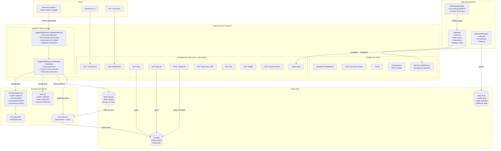
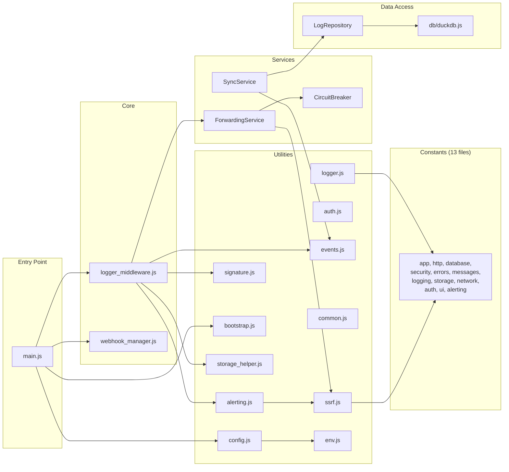

# Application Architecture

> **Webhook Debugger & Logger** is a high-performance, stateless-first application designed to run on the [Apify Platform](https://apify.com). It leverages an in-memory SQL analytics engine (DuckDB) for query performance while using Apify's Dataset and Key-Value Store for durability and persistence.

---

## High-Level Overview

The application follows a **Modular Monolith** architecture with distinct layers for ingestion, processing, storage, and presentation.

| Component       | Technology                 | Purpose                                   | Resilience Strategy                            |
| :-------------- | :------------------------- | :---------------------------------------- | :--------------------------------------------- |
| **Runtime**     | Node.js 20+ (ESM)          | Core execution environment                | Graceful shutdown handling                     |
| **Web Server**  | Express.js                 | HTTP routing, middleware pipeline         | Rate limiting, timeouts                        |
| **Read Model**  | **DuckDB**                 | OLAP queries, filtering, aggregation      | **Disposable**: rebuilds from Dataset on start |
| **Write Model** | Apify Dataset              | Append-only log of all events             | Persistent Source of Truth                     |
| **Sync Layer**  | SyncService + EventEmitter | Event-driven real-time + batch catch-up   | Auto-recovery on restart                       |
| **State Store** | Apify KVS                  | Webhook lifecycle, config, large payloads | Graceful degradation                           |

> The DuckDB read model is intentionally **disposable**. If it fails to initialize, the application still starts — ingestion works via the Apify Dataset. The read model is rebuilt from the Dataset on restart.

---

## System Overview

Webhook Debugger & Logger is an Apify Actor that generates temporary webhook endpoints for testing, debugging, and mocking webhook integrations. It uses a **CQRS (Command Query Responsibility Segregation)** architecture with an event-driven sync layer.



---

## Module Dependency Graph



---

## Data Flow

### Webhook Ingestion (Write Path)

```
Incoming Request
    │
    ▼
LoggerMiddleware.ingestMiddleware
    ├── Recursion check (header loop detection)
    ├── Per-webhook rate limiting (Token Bucket)
    ├── Content-Length > limit? → 413
    ├── Content-Length > KVS threshold? → Stream to KVS
    └── next()
    │
    ▼
LoggerMiddleware.middleware
    ├── Validate webhook ID, IP, auth
    ├── Prepare data (parse, redact, encode)
    ├── Signature verification (if configured)
    ├── Custom script execution (vm.Script sandbox)
    ├── Send HTTP response to caller
    └── Background tasks (fire-and-forget with timeout):
        ├── Actor.pushData(event)  → Dataset (Write Model)
        ├── appEvents.emit('log:received')  → SyncService
        ├── ForwardingService.forwardWebhook()  → Target URL
        └── triggerAlertIfNeeded()  → Slack/Discord
```

### Log Query (Read Path)

```
API Request (GET /logs, /logs/:id)
    │
    ▼
Auth + Rate Limit middleware
    │
    ▼
Route handler
    │
    ▼
LogRepository (parameterized SQL)
    │
    ▼
DuckDB (in-process, connection pooled)
    │
    ▼
JSON response
```

---

## Key Architectural Decisions

### 1. Disposable Read Model

DuckDB is treated as ephemeral. On startup, `SyncService` catches up from the Apify Dataset. This means the system tolerates DuckDB failures without data loss.

### 2. Event-Driven Sync

`SyncService` listens to `appEvents` for real-time inserts and uses batch catch-up for gap recovery. This provides near-real-time query availability without coupling the write path to the read path.

### 3. Connection Pooling + Write Serialization

DuckDB connections are pooled (configurable size). All write operations go through a Bottleneck queue (`maxConcurrent: 1`) to prevent "Database Locked" errors. Reads are parallel.

### 4. Circuit Breaker for Forwarding

`ForwardingService` uses a hostname-level circuit breaker. After consecutive failures, requests to the same host are blocked for a cooldown period. This prevents cascading failures to dead downstream services.

### 5. Hot-Reload Configuration

`HotReloadManager` watches for config changes via:

- **Platform**: KVS polling at configurable intervals
- **Local dev**: `fs.watch` on the INPUT.json file

Config changes propagate through `AppState.applyConfigUpdate()` which updates body parser limits, rate limiters, auth keys, retention, and more — all without restart.

### 6. Streaming Large Payload Offload

Payloads exceeding the KVS offload threshold are streamed directly to Apify KVS before body-parser runs. The log entry stores a reference body with a public URL to the original payload.

---

## Security Architecture

### Trust Boundaries

```
┌─────────────────────────────────────────────────┐
│  Internet (untrusted)                           │
│  ┌───────────────────────────────────────────┐  │
│  │  Ingestion Endpoint /:webhookId           │  │
│  │  • IP whitelist (optional)                │  │
│  │  • Per-webhook rate limiting              │  │
│  │  • Payload size limits                    │  │
│  │  • Recursion detection                    │  │
│  │  • Auth key (optional)                    │  │
│  └───────────────────────────────────────────┘  │
│  ┌───────────────────────────────────────────┐  │
│  │  Management API                           │  │
│  │  • API key authentication (required)      │  │
│  │  • Per-IP rate limiting                   │  │
│  │  • CSP headers on dashboard               │  │
│  │  • Security headers (HSTS, etc.)          │  │
│  └───────────────────────────────────────────┘  │
│  ┌───────────────────────────────────────────┐  │
│  │  Outbound (forwarding, alerts, replay)    │  │
│  │  • SSRF validation (DNS + CIDR check)     │  │
│  │  • Circuit breaker                        │  │
│  │  • AbortController timeouts               │  │
│  └───────────────────────────────────────────┘  │
└─────────────────────────────────────────────────┘
```

### Defense-in-Depth Layers

1. **Network**: SSRF prevention on all outbound URLs, IP whitelisting on ingestion.
2. **Transport**: HSTS enforcement, X-Frame-Options, Permissions-Policy.
3. **Application**: Auth middleware, rate limiting, payload size limits, recursion detection.
4. **Data**: Parameterized SQL, JSON key sanitization, body redaction, header masking.
5. **Output**: XSS prevention via CSP + `escapeHtml()`, generic error messages to callers.

---

## Scalability Characteristics

| Dimension                | Approach                                                        | Limits            |
| ------------------------ | --------------------------------------------------------------- | ----------------- |
| **Concurrent webhooks**  | Dynamic URL generation (up to `MAX_BULK_CREATE`)                | Configurable      |
| **Ingestion throughput** | Node.js event loop + streaming offload for large payloads       | Single-process    |
| **Query performance**    | DuckDB in-process analytics with indexes and connection pooling | Memory-bound      |
| **Write throughput**     | Bottleneck queue (serial writes)                                | ~1000s ops/sec    |
| **Forwarding**           | Circuit breaker + connection pooling + retries                  | Per-host breakers |
| **Memory**               | Configurable via `useFixedMemory` + `fixedMemoryMbytes`         | Platform-limited  |
